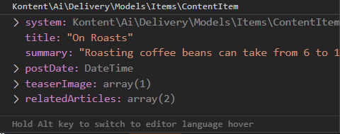

# Kontent.ai Delivery SDK for PHP

[](https://github.com/kontent-ai/delivery-sdk-php/actions/workflows/integrate.yml)
[](https://packagist.org/packages/kontent-ai/delivery-sdk-php)
[](https://codecov.io/gh/kontent-ai/delivery-sdk-php)
[](https://stackoverflow.com/tags/kontent-ai)
[](https://discord.gg/SKCxwPtevJ)

## Summary

The Kontent.ai Delivery PHP SDK is a client library used for retrieving content from Kontent.ai. The best way to use the SDK is to consume it in the form of a [Packagist package](https://packagist.org/packages/kontent-ai/delivery-sdk-php). The library currently supports only PHP 8 and above.

## Sample site

Check out a sample site running on Laravel utilizing this SDK here: [https://github.com/kontent-ai/sample-app-php](https://github.com/kontent-ai/sample-app-php)

## Installation

The best way to install the client is through a dependency manager called [Composer](https://getcomposer.org/):

```sh
composer require kontent-ai/delivery-sdk-php
```

or adjusting your `composer.json` file:

```sh
{
    "require": {
        "kontent-ai/delivery-sdk-php": "^6.0.0"
    }
}
```

### Autoloading

Writing object-oriented applications requires one PHP source file per class definition. One of the biggest annoyances is having to write a long list of needed includes at the beginning of each script (one for each class).

Since the SDK uses [Composer](https://getcomposer.org/) dependency manager and specifies autoload information, Composer generates a [vendor/autoload.php](https://getcomposer.org/doc/01-basic-usage.md#autoloading) file. You can simply include this file and start using the namespaces that those libraries offer without any extra work:

```sh
require __DIR__ . '/vendor/autoload.php';
```
  
## Using the DeliveryClient

The `DeliveryClient` class is the main class of the SDK. Using this class, you can retrieve content from your Kontent.ai projects.

To create an instance of the class, you need to provide a [project ID](https://kontent.ai/learn/tutorials/develop-apps/get-content/get-content-items#a-1-find-your-project-id).

```php
use Kontent\Ai\Delivery\DeliveryClient;

// Initializes an instance of the DeliveryClient client
$client = new DeliveryClient('975bf280-fd91-488c-994c-2f04416e5ee3');
```

There are some other optional parameters that you can use during the `DeliveryClient` instantiation.

* `$previewApiKey` – sets the Delivery Preview API key. The client will automatically start using the preview endpoint for querying. See [previewing unpublished content](#previewing-unpublished-content).
* `$securedProductionApiKey` – sets the production Delivery API key (do not combine it with the Delivery Preview API key)
* `$waitForLoadingNewContent` – makes the client instance wait while fetching updated content, useful when acting upon [webhook calls](https://kontent.ai/learn/tutorials/develop-apps/integrate/webhooks#a-get-the-latest-content).
* `$debugRequests` – switches the HTTP client to debug mode
* `$retryAttempts` – number of times the client will retry to connect to the Kontent.ai API on failures per request

Once you create a `DeliveryClient`, you can start querying your project repository by calling methods on the client instance. See [Basic querying](#basic-querying) for details.

## Basic querying

Once you have a `DeliveryClient` instance, you can start querying your project repository by calling methods on the instance.

```php
// Retrieves a single content item
$item = $client->getItem('about_us');

// Retrieves a list of all content items
$items = $client->getItems();
```

### Filtering retrieved data

The SDK supports full scale of the API querying and filtering capabilities as described in the [API reference](https://kontent.ai/learn/reference/delivery-api#tag/Filtering-content).

```php
use Kontent\Ai\Delivery\QueryParams;

// Retrieves a list of the specified elements from the first 10 content items of
// the 'brewer' content type, ordered by the 'product_name' element value
$response = $client->getItems((new QueryParams())
  ->equals('system.type', 'brewer')
  ->elements(array('image', 'price', 'product_status','processing'))
  ->limit(10)
  ->orderAsc('elements.product_name'));
```

### Getting localized items

The language selection is just a matter of specifying one additional filtering parameter to the query.

```php
use Kontent\Ai\Delivery\QueryParams;

// Retrieves a list of the specified elements from the first 10 content items of
// the 'brewer' content type, ordered by the 'product_name' element value
$response = $client->getItems((new QueryParams())
  ->language('es-ES')
  ->equals('system.type', 'brewer')
  ->elements(array('image', 'price', 'product_status','processing'))
  ->limit(10)
  ->orderAsc('elements.product_name'));
```

### Working with taxonomies

To retrieve information about your taxonomies, you can use the `getTaxonomy` and `getTaxonomies` methods. Additionally, you can specify query [parameters](https://kontent.ai/learn/reference/delivery-api#operation/list-taxonomy-groups).

```php
use Kontent\Ai\Delivery\QueryParams;

// Retrieves a list of the specified taxonomy groups.
$response = $client->getTaxonomies((new QueryParams())
  ->limit(3);

// Retrieves a specific taxonomy group.
$response = $client->getTaxonomy('persona');
```

## Previewing unpublished content

To retrieve unpublished content, you need to create a `DeliveryClient` with both Project ID and Preview API key. Each Kontent.ai project has its own Preview API key.

```php
// Note: Within a single project, we recommend that you work with only
// either the production or preview Delivery API, not both.
$client = new DeliveryClient('YOUR_PROJECT_ID', 'YOUR_PREVIEW_API_KEY');
```

For more details, see [Previewing unpublished content using the Delivery API](https://kontent.ai/learn/tutorials/develop-apps/build-strong-foundation/set-up-preview#a-get-the-latest-version-of-everything).

## Response structure

For full description of single and multiple content item JSON response formats, see our [API reference](https://kontent.ai/learn/reference/delivery-api#operation/list-content-items).

### Single content item response

When retrieving a single content item, you get an instance of the `ContentItem` class. This class contains a 'system' property (with metadata about the content item, such as code name, display name, type, collection, or sitemap location) and respective content item's elements projected as [camelCase](https://en.wikipedia.org/wiki/Camel_case) properties.



### Multiple content items response

When retrieving a list of content items, you get an instance of the `ContentItemsResponse`. This class represents the JSON response from the Delivery API endpoint and contains:

* `Pagination` property with information about the following:
  * `Skip`: requested number of content items to skip
  * `Limit`: requested page size
  * `Count`: the total number of retrieved content items
  * `NextPageUrl`: the URL of the next page
* An array of the requested [content items](#single-content-item-response)

### Properties and their types

* All properties are named in the [camelCase](https://en.wikipedia.org/wiki/Camel_case) style.
* If a property contains a collection of objects, it's typed as an array which is indexed by:
  * codenames, if the contained entities have a code name
  * numbers, if they don't have code names. We use zero-based indexing.
* If a property references linked items (property is of the linked item type), the references are replaced with the respective [content items](#single-content-item-response) themselves.
* If a property is of asset, multiple choice option, or taxonomy group type, it's resolved to respective well-known models from the `Kontent\Ai\Delivery\Models\Items` namespace.
* All timestamps are typed as `\DateTime`.
* All numbers are typed as `float`.

### Mapping custom models

It's possible to instruct the SDK to fill and return your own predefined models. To do that you have to implement:

* `TypeMapperInterface` (required) - to provide mapping of Kontent.ai content types to your models
* `PropertyMapperInterface` (optional) - to change the default behavior of property mapping (the default property translation works like this: 'content_type' -> 'contentType')
* `ValueConverterInterface` (optional) - to change the way content element types are mapped to PHP types
* `ContentLinkUrlResolverInterface` (optional) - to change the way the links in Rich text elements are resolved see [Resolving links to content items](./wiki/Resolving-links-to-content-items.md).
* `InlineLinkedItemsResolverInterface` (optional) - to change the way content items in Rich text elements are resolved see [Resolving content items and components in Rich text](./wiki/Resolving-content-items-and-components-in-Rich-text.md).

The default implementation of all the interfaces can be found in a class called [`DefaultMapper`](./src/Kontent/Ai/Delivery/DefaultMapper.php).

Example:

```php
class TetsMapper extends DefaultMapper
{
    public function getTypeClass($typeName)
    {
        switch ($typeName) {
            case 'home':
                return \Kontent\Ai\Tests\E2E\HomeModel::class;
            case 'article':
                return \Kontent\Ai\Tests\E2E\ArticleModel::class;
        }

        return parent::getTypeClass($typeName);
    }
}
...

public function testMethod()
{
    $client = new DeliveryClient('975bf280-fd91-488c-994c-2f04416e5ee3');
    $client->typeMapper = new TetsMapper();
    $item = $client->getItem('on_roasts');
    $this->assertInstanceOf(\Kontent\Ai\Tests\E2E\ArticleModel::class, $item); // Passes
}

```

The `ArticleModel` can then look like this (and contain only the properties you need to work with):

```php
class ArticleModel
{
    public $system = null;
    public $title = null;
    public $urlPattern = null;
}
```

## Feedback & Contributing

Check out the [contributing](./CONTRIBUTING.md) page to see the best places to file issues, start discussions, and begin contributing.

1. Clone the repository
2. Run `composer install` to install dependencies
3. Run `phpunit` to verify that everything works as expected

### Developing on Windows

Have a look at our cool [tutorial](./wiki/Developing-PHP-in-Visual-Studio-Code-for-Dummies.md) on developing PHP on Windows with Visual Studio Code!

### Developing on Linux

Do you prefer penguins? Check out our [tutorials](./wiki/Configuring-PHP-Storm-on-Linux.md) on developing PHP on Linux with PhpStorm!

### Wall of Fame

We would like to express our thanks to the following people who contributed and made the project possible:

* [Stephen Rushing](https://github.com/stephenr85/) - [eSiteful](http://www.esiteful.com/home) - [ORIGINAL WORK](https://github.com/stephenr85/KenticoCloud.Deliver.PHP)

Would you like to become a hero too? Pick an [issue](https://github.com/kontent-ai/delivery-sdk-php/issues) and send us a pull request!
