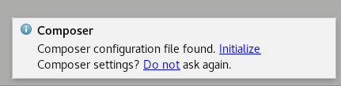
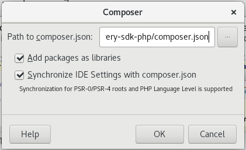
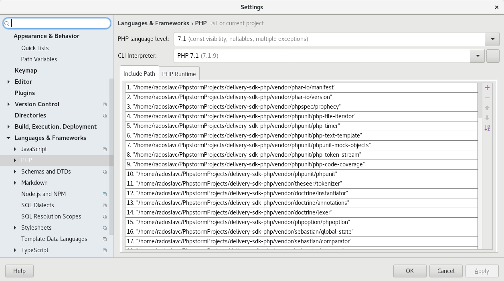

This guide describes how to configure and run the PHP SDK in [JetBranis WebStorm](https://www.jetbrains.com/webstorm/) on Linux. It has been written for [Fedora Linux 26](https://getfedora.org) and tested on [Ubuntu 17.04](https://www.ubuntu.com).

## Prerequisites</summary>

- PHP
- [JetBrains WebStorm](https://www.jetbrains.com/webstorm/)
- [Composer](https://getcomposer.org)

## Installing and Verifying Prerequisites

### PHP

PHP is included in workstation installation. To verify this run the following command in a terminal:

```sh
php --version
```

Expected output:

```plain
PHP 7.1.9 (cli) (built: Sep  6 2017 11:45:26) ( NTS )
Copyright (c) 1997-2017 The PHP Group
Zend Engine v3.1.0, Copyright (c) 1998-2017 Zend Technologies
```

### Composer

Composer is a PHP package management system. You can install it via a terminal from official repositories:

```sh
# Fedora
sudo dnf install composer
# Ubuntu
sudo apt install composer
```

After the installation you can verify the state in a terminal:

```sh
composer --version
```

Expected output:

```plain
Composer version 1.5.2 2017-09-11 16:59:25
```

All prerequisites are installed now. Let's move forward and configure PHPStorm.

## Configuring PHPStorm

After cloning a repository it's necessary to restore packages with Composer. Run this command in the PHPStorm Terminal:

```sh
composer update
```

After a successful update, please restart the IDE and finish the configuration.

### Initializing Composer

The IDE will ask for Composer initialization:



Simply click "Initialize" and let the IDE use the suggested values:



### Setting up the Tests Run configuration

The final step is to create a test configuration. In the Project Tree, right click the tests folder and choose "Run 'tests'" from the menu. An edit dialog will appear:


Choose fix and setup "PHP language level" and "CLI Interpreter" this way:



Since now, it's possible to run PHPUnit tests.

#### Configuring a Debugger

Install XDebug via a terminal:

```sh
# Fedora
sudo dnf install php-xdebug
# Ubuntu
sudo apt install php-xdebug
```
